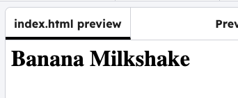

<h2 class="c-project-heading--task">Name your recipe</h2>

The example recipe in this project is for a banana milkshake, but you can choose your own favourite recipe.

<h2 class="c-project-heading--explainer">Follow these instructions</h2>

In the `<body>` section, add a name for your recipe.

--- code ---
---
filename: index.html
language: html
line_numbers: true
line_number_start: 7
line_highlights: 8
---
<body>
<h1>Banana Milkshake</h1>

</body>

--- /code ---

## Now run your code

You should see your title.

Run your code and check that the title `Banana Milkshake` appears.
