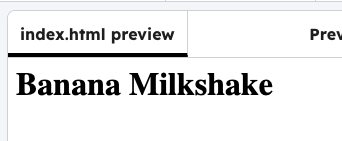

## Name your recipe

The example recipe in this project is for a banana milkshake, but you can choose your own favourite recipe.

In the `<body>` section, add a name for your recipe.

```html filename="index.html" line_numbers="true" line_number_start="7" line_highlights="8"
<body>
<h1>Banana Milkshake</h1>

</body>
```

## Now run your code

You should see your title.


