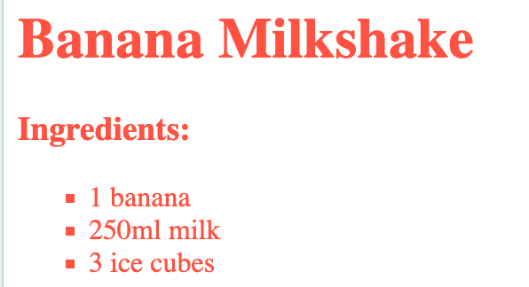

<h2 class="c-project-heading--task">Bullet styles</h2>

--- task ---

Add a style to change the bullet points to squares instead of circles:

--- /task ---

--- code ---
---
language: css
line_numbers: true
line_number_start: 9
---
ul {
    list-style-type: square;
}
--- /code ---

--- task ---

Click **Run** to see the new shape.

--- /task ---

{:style=“width:50%;“}

