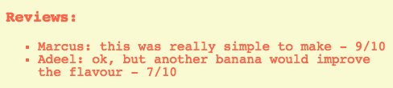
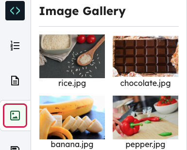

<h2 class="c-project-heading--task">Challenges</h2>

Add more styles and images to upgrade your project.

<h2 class="c-project-heading--explainer">Follow these instructions</h2>

## Step 1

Change the background colour of your page by adding a background attribute to your `body` style in `style.css`.

--- code ---
---
language: css
line_numbers: true
line_number_start: 1
line_highlights: 2-3
---
body {
  color: tomato;
  background: beige;
}
--- /code ---

## Step 2

Ask a few of your friends to leave a review for your recipe and add it to your site.

## Step 3

Choose an image from the pictures tab and add it to your page.

{:style=“width:50%;“}

Here’s some HTML code to help you:

--- code ---
---
language: html
line_numbers: true
line_number_start: 19
line_highlights: 20
---
  

  
</body>
--- /code ---

## Now run your code

Confirm the observable result.
