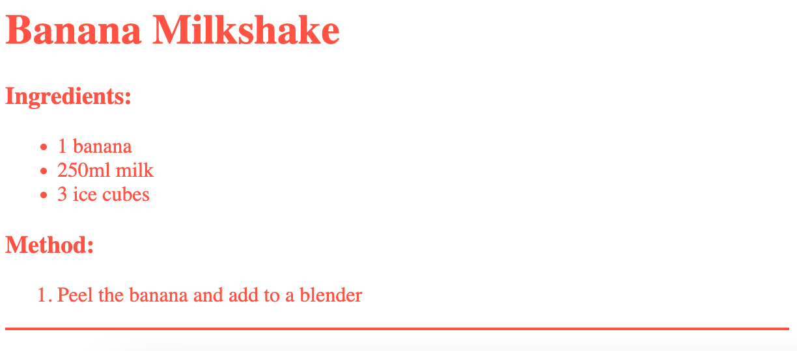

<h2 class="c-project-heading--task">Style the line</h2>

--- task ---

Add CSS code to set the style of the line. 

--- /task --- 

--- task ---

Switch back to `style.css`.

Replace `???` with a colour you like.

--- /task ---

--- code ---
---
language: css
line_numbers: true
line_number_start: 9
---
hr {
    height: 2px;
    border: none;
    background-color: ???;
}
--- /code ---

--- task ---

Click **Run** to see the new style.

--- /task ---

