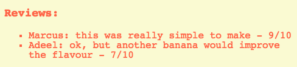
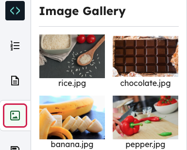

## Challenges

Add more styles and images to upgrade your project.

> [!CHALLENGE]
>
> To change the background colour of your page, add a `background` attribute to your `body` style in `style.css`.
>
> ```css line_numbers="true" line_number_start="11" line_highlights="15-18"
> ul {
>     list-style-type: square;
> }
>
> body {
>   color: tomato;
>   background: beige;
> }
> ```

> [!CHALLENGE]
>
> Ask a few of your friends to write reviews of your recipe, and add them to your site.
>
> 

> [!CHALLENGE]
>
> Choose an image from the **Image gallery** tab and add it to your page.
>
> {:style="width:50%;"}
>
> Here is some HTML code to help you:
>
> ```html line_numbers="true" line_number_start="19" line_highlights="20"
>   <hr>
>   
> </body>
> ```

## Now run your code

Click on **Run** and check that your new styles, reviews, and image appear on the page.
