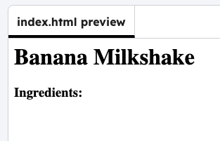

<h2 class="c-project-heading--task">Ingredients section</h2>

Under the name, add an `Ingredients:` heading.

### Step 1

--- code ---
---
filename: index.html
language: html
line_numbers: true
line_number_start: 7
line_highlights: 10
---
<body>
<h1>Banana Milkshake</h1>
  
  <h3>Ingredients:</h3>
  
</body>

--- /code ---

### Step 2

**Test:** Run your code to see your title.

