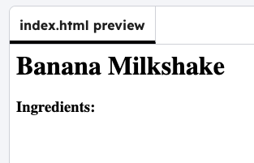

## Add an ingredients section

Under the name, add an `Ingredients:` heading.

```html filename="index.html" line_numbers="true" line_number_start="7" line_highlights="10"
<body>
<h1>Banana Milkshake</h1>
  
  <h3>Ingredients:</h3>
  
</body>
```

## Now run your code

You should see the heading under your title.


