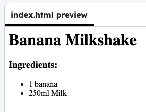

<h2 class="c-project-heading--task">First item</h2>

### Step 1

Add your ingredients in a list.

### Step 2

Start and end a list using `<ul>`{:.language-html} tags.

### Step 3

Add your first ingredient inside `<li>`{:.language-html} tags.

--- code ---
---
filename: index.html
language: html
line_numbers: true
line_number_start: 10
line_highlights: 11-14
---
  <h3>Ingredients:</h3>
  <ul>
    <li>1 banana</li>
    <li>250ml Milk</li>
  </ul>

</body>

--- /code ---

### Step 4

**Test:** Run your code to see your first ingredient. 

Add more list items for the rest of the ingredients in your recipe.

