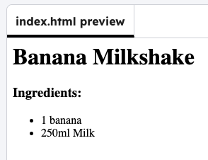

<h2 class="c-project-heading--task">Add ingredients</h2>

Add your ingredients in a list.

## Step 1

Start and end a list using `<ul>` tags.

## Step 2

Add your first ingredient inside `<li>` tags.

--- code ---
---
filename: index.html
language: html
line_numbers: true
line_number_start: 10
line_highlights: 11-13
---
  <h3>Ingredients:</h3>
  <ul>
    <li>1 banana</li>
  </ul>

</body>

--- /code ---

## Now run your code

You should see your first ingredient.

Add more list items for the rest of the ingredients in your recipe.

