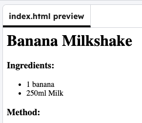

## Add a method section

Add **ordered list** tags to make numbered steps for the method.

```html line_numbers="true" line_number_start="14" line_highlights="15-18"
  </ul>
  <h3>Method:</h3>
  <ol>
    
  </ol>
</body>
```

## Now run your code

Check that the heading "Method:" appears below the ingredients list.


