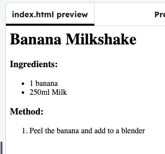

<h2 class="c-project-heading--task">Steps</h2>

Write down the first step in your recipe, using `<li>` and `</li>`:

<h2 class="c-project-heading--explainer">Follow these instructions</h2>

## Step 1

--- code ---
---
language: html
line_numbers: true
line_number_start: 15
line_highlights: 17
---
  <h3>Method:</h3>
  <ol>
    <li>Peel the banana and add to a blender</li>
  </ol>
</body>
--- /code ---

## Step 2

Click **Run** to see your instruction appear, with a number 1 as it is the first instruction in the list.

Finish adding the rest of the steps to make your recipe.

## Now run your code

Click **Run** and check that your first method step appears with the number `1`.
