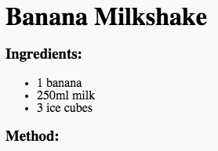

<h2 class="c-project-heading--task">Method</h2>

--- task ---

Add **ordered list** tags for making numbered steps for the method.

--- /task --- 

--- code ---
---
language: html
line_numbers: true
line_number_start: 13
line_highlights: 14-18
---
</ul>
<h3>Method:</h3>
<ol>

</ol>
</body>
--- /code ---

--- task ---

Click **Run** to check you have added the code in the right place.

--- /task ---

