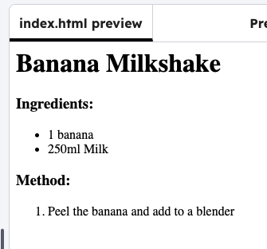

## Add steps

Add the steps for your recipe.

Write down the first step, using `<li>` and `</li>`:

```html line_numbers="true" line_number_start="15" line_highlights="17"
  <h3>Method:</h3>
  <ol>
    <li>Peel the banana and add to a blender</li>
  </ol>
</body>
```

## Now run your code

Click on **Run** and check that your steps appear with numbers.

Add the rest of the steps to make your recipe.


