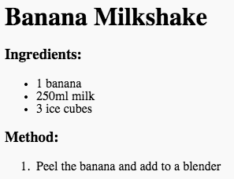

<h2 class="c-project-heading--task">Steps</h2>

--- task ---

Write down the first step in your recipe, using `<li>` and `</li>`:

--- /task --- 

--- code ---
---
language: html
line_numbers: false
line_number_start: 17
line_highlights: 18
---
<ol>
<li>Peel the banana and add to a blender</li>
</ol>
--- /code ---

--- task ---
Click **Run** to see your instruction appear, with a number 1 as it is the first instruction in the list.

Finish adding the rest of the steps to make your recipe.
--- /task ---

