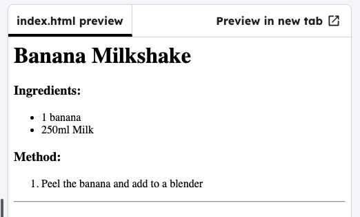

<h2 class="c-project-heading--task">Horizontal line</h2>

### Step 1

Add a horizontal line at the end of your recipe using the `
` tag.

--- code ---
---
language: html
line_numbers: true
line_number_start: 18
line_highlights: 19
---
  </ol>
  

</body>
--- /code ---

### Step 2

Click **Run** to see the line.

