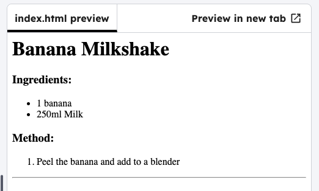

## Add a horizontal line

Add a horizontal line at the end of your recipe.

Use an `<hr>` tag to add the line.

```html line_numbers="true" line_number_start="18" line_highlights="19"
  </ol>
  <hr>
</body>
```

## Now run your code

Click on **Run** and check that a horizontal line appears below the recipe.


