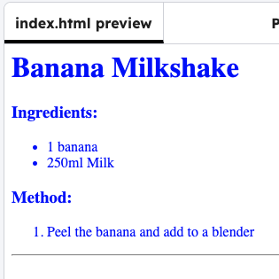

<h2 class="c-project-heading--task">Add colour</h2>

Style the recipe with CSS.

## Step 1

Click on the **Project files** icon, and open the `style.css` file.

## Step 2

Add the code below to make all of the text blue, then click on **Run** to see the result.

Then, experiment with other colours.

### Tip

You can find [more CSS colour names here](http://jumpto.cc/colours){:target="_blank"}.

--- code ---
---
language: css
line_numbers: true
line_number_start: 1
line_highlights: 1-3
---
body {
    color: blue;
}
--- /code ---

## Now run your code

Click on **Run** and check that the recipe text changes to the colour you have chosen.

{:style="width:50%;"}

