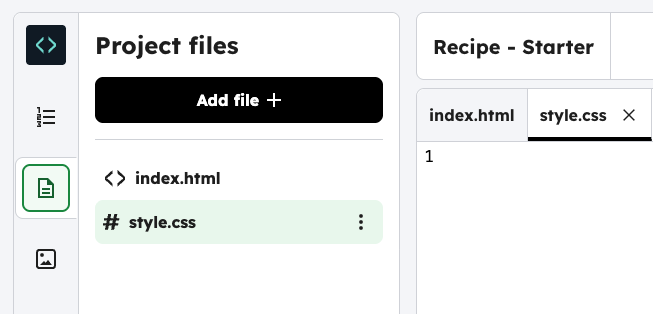
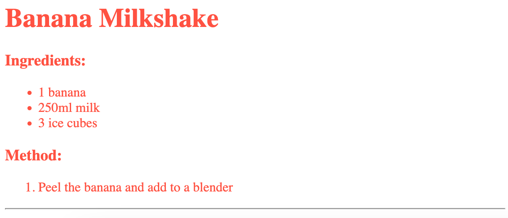

<h2 class="c-project-heading--task">Horizontal line</h2>

--- task ---

Add a horizontal line at the end of your recipe using the `
` tag.

--- /task ---

--- task ---

Select your `index.html` file in the sidebar.

{:style=“width:50%;“}

--- /task ---

--- code ---
---
language: html
line_numbers: true
line_number_start: 19
line_highlights: 20
---
</ol>

--- /code ---

--- task --- 

Click **Run** to see the line.

--- /task ---

