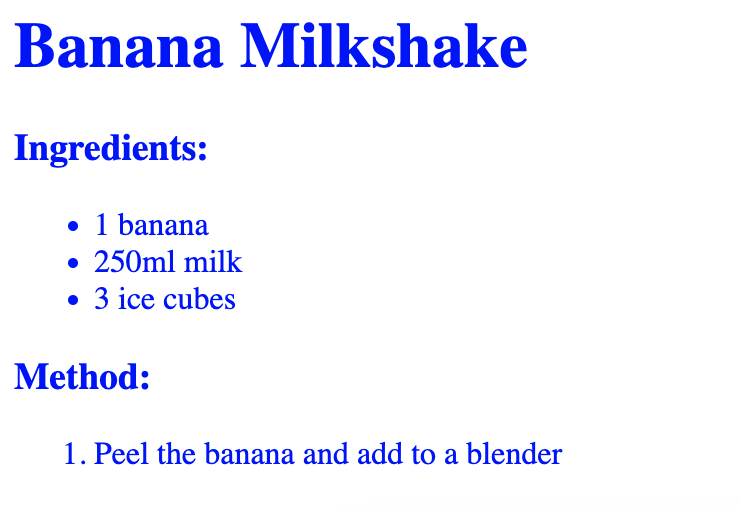

<h2 class="c-project-heading--task">Colours</h2>

--- task ---

Style the recipe with CSS

--- /task --- 

--- task ---

Click on the file icon, and the `style.css` file.

--- /task ---

--- task ---

Add the code below to make all of the text blue.

Experiment with other colours, then click **Run** to see the result.

--- /task ---

### Tip

You can find more CSS colour names [here](http://jumpto.cc/colours){:target="_blank"}.

--- code ---
---
language: css
line_numbers: true
line_number_start: 1
line_highlights: 1-3
---
body {
    color: blue;
}
--- /code ---

--- task---

Click **Run** to see the results. 

--- /task ---

{:style="width:50%;"}

