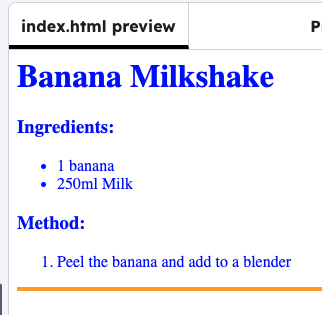

<h2 class="c-project-heading--task">Style the line</h2>

Add CSS code to set the style of the line.

<h2 class="c-project-heading--explainer">Follow these instructions</h2>

## Step 1

Add the code below to the CSS file. 

Edit the code:
- Replace `orange` with a colour you like. 
- Change the `height` to make the line thinner or thicker.

### Tip

In `height: 2px` px is short for pixels, and is the number of dots on a screen. 

--- code ---
---
language: css
line_numbers: true
line_number_start: 1
line_highlights: 5-9
---
body {
    color: blue;
}

hr {
    height: 4px;
    border: none;
    background-color: orange;
}
--- /code ---

## Step 2

Click **Run** to see the new style.

## Now run your code

Confirm the observable result.
