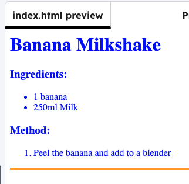

## Style the line

Add CSS code to set the style of the line.

Add the code below to the CSS file.

Edit the code:
- Replace `orange` with a colour of your choice
- Change the `height` to make the line thinner or thicker

> [!TIP]
>
> In `height: 2px`, 'px' is short for 'pixels'. It means the number of dots on a screen.

```css line_numbers="true" line_number_start="1" line_highlights="5-9"
body {
    color: blue;
}

hr {
    height: 4px;
    border: none;
    background-color: orange;
}
```

## Now run your code

Click on **Run** and check that the recipe uses your new colours and line style.


