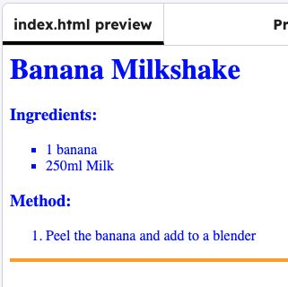

<h2 class="c-project-heading--task">Bullet styles</h2>

Add a style to change the bullet points to squares instead of circles:

<h2 class="c-project-heading--explainer">Follow these instructions</h2>

## Step 1

--- code ---
---
language: css
line_numbers: true
line_number_start: 5
line_highlights: 11-13
---
hr {
    height: 4px;
    border: none;
    background-color: orange;
}

ul {
    list-style-type: square;
}
--- /code ---

## Step 2

Click **Run** to see the new shape.

{:style=“width:50%;“}

## Now run your code

Confirm the observable result.
