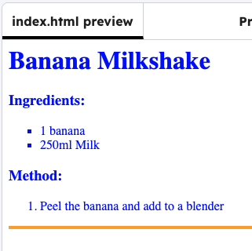

<h2 class="c-project-heading--task">Style the bullet points</h2>

Add a style to change the bullet points to squares instead of circles.

## Step 1

Add this code to the CSS file:

--- code ---
---
language: css
line_numbers: true
line_number_start: 5
line_highlights: 11-13
---
hr {
    height: 4px;
    border: none;
    background-color: orange;
}

ul {
    list-style-type: square;
}
--- /code ---

## Now run your code

Click on **Run** and check that the bullet points in the ingredients list are square.

{:style=“width:50%;“}

